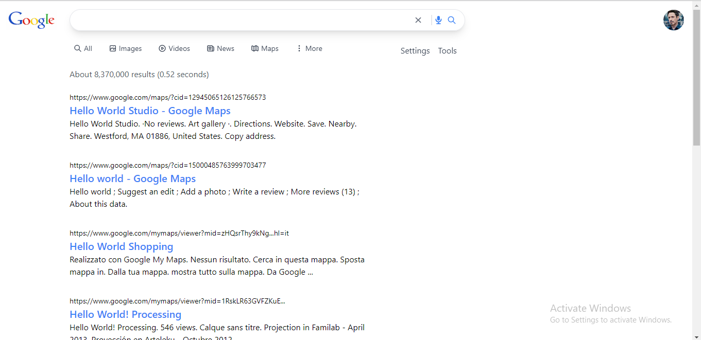

##  Google Clone
### The clone uses a simple search mock data google search data t emulate the UI functionality as the api request to the endpoint would run out easily if 100 users make a request.

link: <a href="https://stark-googleclone.netlify.app">Google</a>
